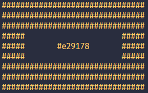
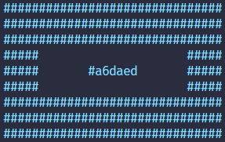
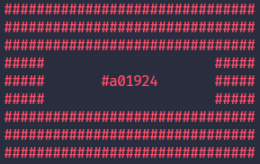
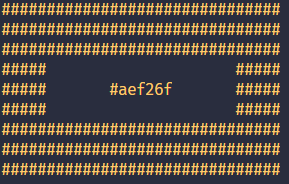
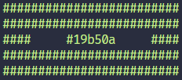
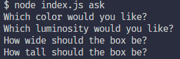
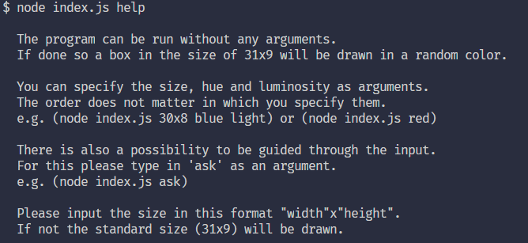

# Random Color Generator

> A node.js app which prints out a colored box to the console.

## Dependencies

- [prompt-sync](https://www.npmjs.com/package/prompt-sync)
- [chalk](https://www.npmjs.com/package/chalk)
- [randomcolor](https://www.npmjs.com/package/randomcolor)

## Setup

Clone the repo from GitHub and then install the dependencies:

```sh
git clone https://github.com/Thoud/random-color-generator.git
cd random-color-generator
yarn or npm install
```

## Usage

The script can be run without any arguments. If done so a box in the size of 31x9 will be drawn in a random color.

```sh
node index.js
```



You can specify the size, hue and luminosity as arguments.The order does not matter in which you specify them. However the color of the box will always get a random shade of the specified color.

### Hue

- red
- orange
- yellow
- green
- blue
- purple
- pink
- monochrome

### Lightness

- bright
- light
- dark

Please input the size in this format "width"x"height". If not the standard size (31x9) will be drawn.

```sh
node index.js blue light
```



```sh
node index.js red
```



```sh
node index.js light
```



```sh
node index.js 25x5 green
```



There is also a possibility to be guided through the input.For this please type in 'ask' as an argument.

```sh
node index.js ask
```



To get a short explanation directly inside the terminal pass in 'help' or '--help' as an argument.

```sh
node index.js help
```


